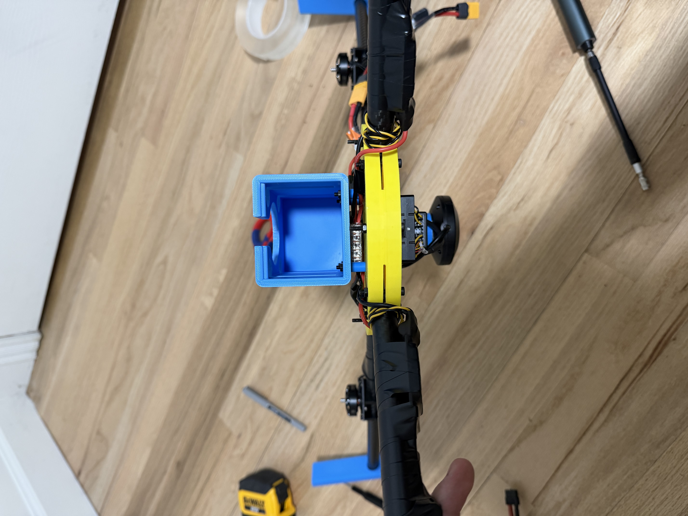
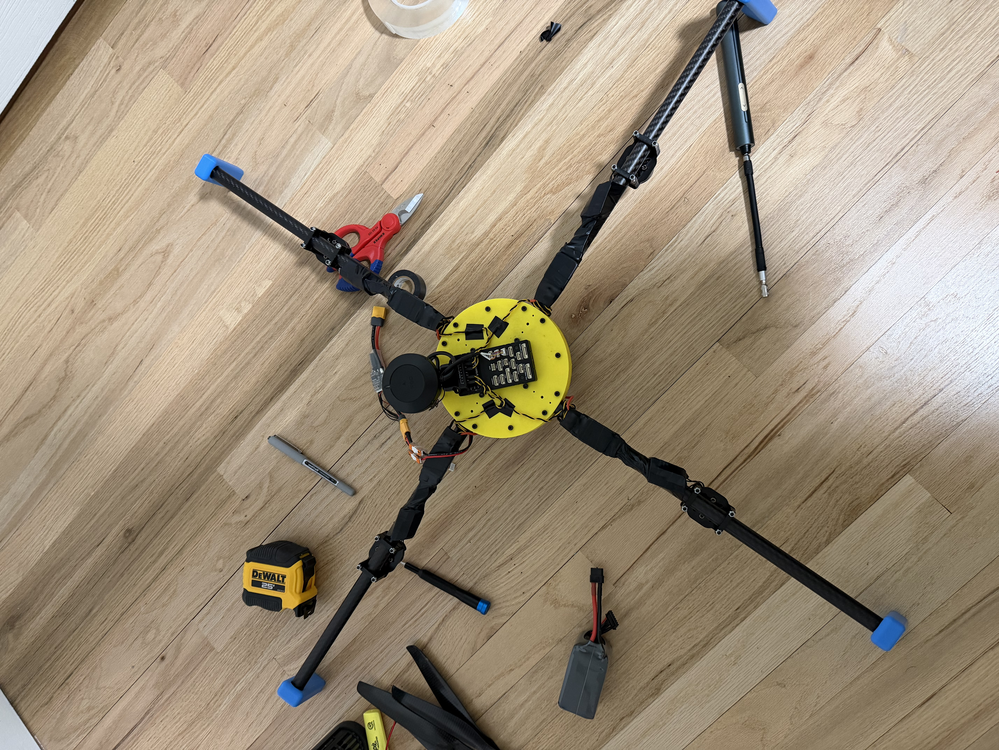
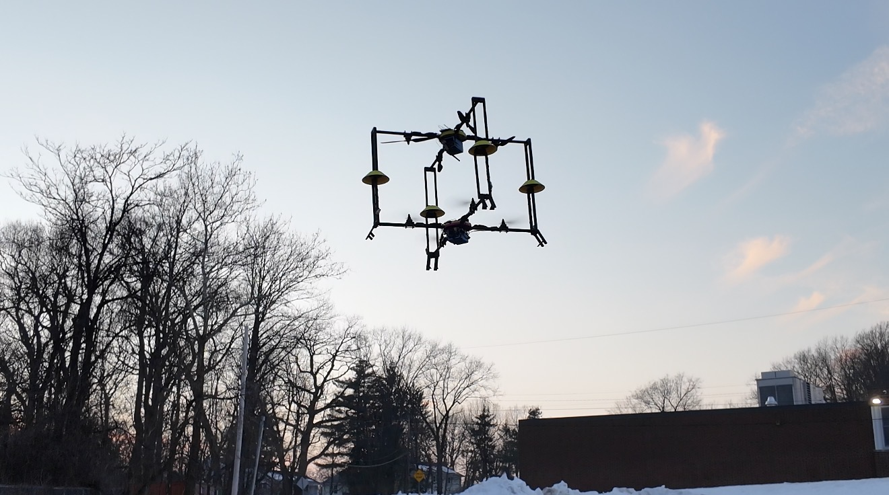

<div align="center">
  <h1>Mother-Ship Docking Drone System</h1>
  <p>My project exploring how GPS, UWB, and vision can work together for relative positioning and drone docking.</p>

  <p>
    <a href="README.zh-CN.md">Chinese</a>
    &middot;
    <a href="https://isef.rosebeg.com">Project Website</a>
    &middot;
    <a href="https://github.com/Ha22yX/UWB-Project">UWB Module</a>
    &middot;
    <a href="https://github.com/Ha22yX/OpenMV-AprilTag">Vision Module</a>
  </p>

  <p>
    
    
    
    
    
  </p>
</div>

<p align="center">
  
</p>

I am building a system that would let a smaller drone approach and dock with a larger “mother” drone in the air. This repository records my hardware, code, and experiments as I work toward that goal.

**Current status:** I have completed the theoretical work and validation of the underlying principles. I have assembled the hardware and carried out preliminary flight tests, including a test with the two drones connected before takeoff. The complete autonomous approach and docking sequence is still unfinished.

## Why I started this project

I have thought drones were cool since I was a kid. I wanted to turn that interest into something I could design, build, and test myself, and getting two drones to meet and dock in the air gave me a problem I wanted to work on.

The question that drew me in was how to get an accurate relative position estimate over a wide range of distances. For the docking system I want to build, relying on a single sensing method makes it difficult to balance coverage, precision, and reliability.

GPS offers wide outdoor coverage, but ordinary GPS alone does not provide the precision I need for close docking. [RTK can improve GNSS accuracy](https://www.u-blox.com/en/technologies/rtk-real-time-kinematic) with correction data and suitable signal conditions. UWB and AprilTag vision can provide more precise local measurements for this task, but UWB needs the drone to stay within the anchors' useful range, and the camera needs a clear view of the marker at a usable distance.

That is why I want to combine these methods: satellite positioning for the wider approach, UWB for relative positioning as the drones get closer, and vision for the final alignment. My goal is to explore how sensor fusion can keep the relative position estimate useful across those stages, using drone docking as the application. It connects a positioning problem I want to solve with something I have enjoyed since childhood.

## What I am trying to build

I wanted to explore how one drone could find another and line up with it while both are moving. For docking, the smaller drone needs to know its position relative to the mother drone's frame, including how far it is from the docking point.

My design uses different sensors at different stages:

| Stage | Method | What I use it for |
| --- | --- | --- |
| Initial approach | GPS / RTK-GPS | Bring the drones into the same area. |
| Relative positioning | UWB anchors on the mother frame and a tag on the child drone | Calculate the child drone's position relative to the docking frame. |
| Close-range alignment | OpenMV camera and AprilTag markers | Estimate the remaining position and angle offset. |
| Connection | PX4 / MAVLink and an electromagnetic docking mechanism | Control the final approach and connect the two drones. |

The UWB part turns distances from several anchors into a local `x, y, z` estimate. The camera is intended to refine the alignment close to the docking point. The complete sequence still needs to be validated in flight.

## Building the hardware

I designed parts in SolidWorks and assembled physical prototypes for testing. The [CAD files](hardware/solidworks/) include the drone platform, docking frame, battery bay, GPS mounts, clamps, and electromagnet connectors.

The photo below shows the larger test setup with the mother frame and child drone.

<p align="center">
  
</p>

These two photos show my assembly work in more detail:

<table>
  <tr>
    <td align="center" width="50%">
      
    </td>
    <td align="center" width="50%">
      
    </td>
  </tr>
  <tr>
    <td align="center">Side view during assembly.</td>
    <td align="center">Top view of the frame and electronics during assembly.</td>
  </tr>
</table>

## Testing the two drones while connected

Before attempting docking between independently flying drones, I connected the two drones on the ground and tested them together. I wanted to check whether they could take off and fly safely in that connected configuration.

<p align="center">
  
</p>

*The two drones during a flight test with them already connected before takeoff.*

This photo records a preliminary test of flying together. Autonomous approach, alignment, and connection in the air still need their own complete validation.

## Where I am now

| Part of the project | Progress |
| --- | --- |
| Theoretical design and validation of the underlying principles | Completed. |
| Hardware design and assembly | Physical prototypes built; CAD files and assembly photos included. |
| Flight with the drones already connected | Preliminary test carried out to investigate whether they could fly together safely. |
| Full flight and docking validation | Incomplete after multiple test attempts. |
| Autonomous mid-air docking | Not yet achieved. |

I have made multiple flight-test attempts, but they have not led to a completed autonomous docking demonstration. My current blocker is unstable altitude data in the existing open-source RTK-GPS software setup I have been using.

During stationary tests, **the reported GPS altitude kept fluctuating by approximately ±5 m even though the drone was not moving**. That makes it unsafe to continue the approach and docking experiments with the current setup. The theoretical work is complete, but the altitude issue and full flight validation still need to be resolved.

The repository includes a [GPS drift logger and plotter](gps_drift_test/GPS_Drift_Logger.py) for recording position data and inspecting altitude changes.

My next steps are to:

1. Resolve the altitude-data problem and check that the height readings are stable.
2. Validate the readings in controlled flight before resuming approach and docking tests.
3. Complete and document the full autonomous docking sequence.

## Code and tools

I use PX4/Pixhawk for flight control, ESP32-S3 boards for communication and sensor integration, and Python for debugging and analysis. I originally kept some of the whole-drone code in the UWB repository. It now lives here, alongside the rest of the docking project:

| Repository | What is in it |
| --- | --- |
| This repository | Mother/child ESP-NOW firmware, Pixhawk communication tests, UWB-to-flight-controller and OpenMV integration, debugging tools, GPS drift tools, CAD files, and project photos. |
| [UWB-Project](https://github.com/Ha22yX/UWB-Project) | The UWB module itself: ranging, filtering, position solving, anchor/tag firmware, wiring notes, and UWB visualization. |
| [OpenMV-AprilTag](https://github.com/Ha22yX/OpenMV-AprilTag) | AprilTag detection, position and orientation output, and PC visualization tools. |

The [firmware guide](firmware/README.md) explains the individual sketches. The [migration map](docs/repository-layout.md) records their old and new locations, including the older prototypes.

Some useful files in this repository:

```text
firmware/docking/               Mother and child ESP-NOW control sketches
firmware/pixhawk/               Pixhawk TELEM / MAVLink experiments
firmware/integration/           UWB position-to-Pixhawk follow-control experiment
firmware/openmv/                ESP32-side OpenMV UART and web-display experiments
tools/                         SiK radio debugging and AprilTag pose visualization
archive/old-main/               Earlier whole-drone prototypes and RTK forwarding script
docs/repository-layout.md       Repository responsibilities and migration map
Drone Control.py                 Early drone-control experiment
Router_Comm_Test.py              Router communication test
UDP_MAVLink_Comm_Test.py         Bidirectional MAVLink communication test
serial_px4_udp_router.py         Serial-to-UDP bridge for the flight controller
gps_drift_test/                  GPS recording and plotting tools
hardware/solidworks/             My SolidWorks source files
.github/assets/                 SVG overview and prototype, assembly, and flight-test photos
requirement.txt                 Python dependencies
```

## Running the experiments

Install Python and Git, then set up the repository:

```bash
git clone https://github.com/Ha22yX/Mother-Ship-Docking-Drone-System.git
cd Mother-Ship-Docking-Drone-System
pip install -r requirement.txt
```

The scripts are individual experiments. For example, `serial_px4_udp_router.py` connects a flight controller's serial link to UDP, and `UDP_MAVLink_Comm_Test.py` checks communication through that router. Their command-line options are available with:

```bash
python serial_px4_udp_router.py --help
python UDP_MAVLink_Comm_Test.py --help
```

For Arduino sketches, start with the [firmware guide](firmware/README.md). For the moved AprilTag 3D viewer, install its additional dependencies with `pip install -r tools/requirements.txt`; the [tools notes](docs/repository-layout.md#python-tools) explain which script to use.

Check ports, baud rates, network addresses, and PX4 settings against the actual hardware before running a test. These files are research code; flight use still requires bench checks, propeller-off tests, and failsafe setup. The CAD files also need dimensions, materials, and fasteners checked before fabrication.

## License

[MIT](LICENSE).
