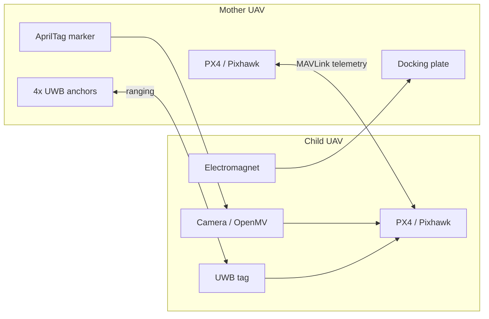

<div align="center">
  <h1>Mother-Ship Docking Drone System</h1>
  <p>Dual-UAV docking research focused on estimating the child drone's position relative to a moving mother drone.</p>

  <p>
    <a href="README.zh-CN.md">Chinese</a> &middot;
    <a href="https://isef.rosebeg.com">Project Website</a> &middot;
    <a href="https://github.com/Ha22yX/UWB-Project">UWB Companion Repo</a>
  </p>

  <p>
    
    
    
    
    
  </p>
</div>

<p align="center">
  
</p>

This repository is the system-level workspace for an experimental aerial docking platform. The key problem is not simply flying to a GPS coordinate. The child UAV must continuously estimate where it is inside the moving coordinate frame of the mother UAV, then convert that relative state into PX4-compatible control targets.

> Status: research prototype. This repository contains early PX4/MAVLink, GPS drift, UDP routing, and communication experiments. It is not a ready-to-fly autopilot package.

## Core Idea: Relative Position First

Physical docking needs relative localization, not just absolute latitude and longitude. The proposed system combines three sensing layers:

| Stage | Main sensor | Role | Control output |
| --- | --- | --- | --- |
| Far approach | GPS / RTK-GPS | Bring both UAVs into the same operating area. | Global position target |
| Mid-range alignment | UWB | Estimate child position in the mother-platform frame. | Relative `x, y, z` |
| Final alignment | AprilTag vision | Correct terminal lateral, vertical, and pose error. | Visual servoing error |
| Docking | UWB + vision + PX4 telemetry | Hold a low-speed approach and trigger attachment. | Position or velocity setpoint |

The UWB layer is the main relative-position solution. The mother platform carries four anchors and the child drone carries one tag. Distances from the tag to each anchor are converted into a 3D estimate in the docking-frame coordinate system.

## Tech Stack

| Layer | Technology | Purpose |
| --- | --- | --- |
| Flight controller | PX4 / Pixhawk | Autopilot platform receiving telemetry and future setpoints. |
| Communication | MAVLink, MAVSDK, pymavlink | Vehicle connection, telemetry checks, heartbeat tests, and serial-to-UDP routing. |
| Relative localization | UWB anchors/tag | Mid-range relative `x, y, z` estimate between mother and child UAVs. |
| Terminal vision | AprilTag, OpenMV/camera concept | Fine alignment near the docking plate. |
| Companion hardware | ESP32-S3, ESP-NOW concept | Embedded communication and localization support in the companion repo. |
| Analysis | Python, matplotlib | GPS drift logging and experiment visualization. |

## System Concept



## UWB Relative Localization

The UWB implementation, test firmware, trilateration code, and visualization tools live in the companion repository:

[Ha22yX/UWB-Project](https://github.com/Ha22yX/UWB-Project)

Current test geometry:

- Four anchors are placed at the midpoints of a square docking frame.
- Square side length: `35.5 in` (`0.9017 m`).
- Coordinate origin: center of the docking frame.
- `an0`: right midpoint, approximately `(+HALF, 0, 0)`.
- `an1`: bottom midpoint, approximately `(0, -HALF, 0)`.
- `an2`: left midpoint, approximately `(-HALF, 0, 0)`.
- `an3`: top midpoint, approximately `(0, +HALF, 0)`.
- Positive `z` points above the anchor plane.

The solver pipeline:

1. Read serial ranging output such as `an0:0.57m`.
2. Filter each anchor distance with a small median filter.
3. Linearize range equations using anchor 0 as the reference.
4. Solve `x` and `y` with least squares.
5. Estimate `z` from range residuals and choose the positive solution above the anchor plane.
6. Emit relative position, for example `[POS] x=0.031 m, y=-0.042 m, z=0.615 m`.

This gives the child UAV a mother-frame position estimate even when both vehicles are moving.

## Repository Scope

This repository contains early Python experiments around PX4 communication, UDP routing, MAVSDK connectivity, and GPS drift analysis. Embedded UWB firmware, ESP-NOW mother/child firmware, Pixhawk integration sketches, OpenMV experiments, and visualization tools are maintained in [UWB-Project](https://github.com/Ha22yX/UWB-Project).

```text
.
├── Drone Control.py
├── Router_Comm_Test.py
├── UDP_MAVLink_Comm_Test.py
├── serial_px4_udp_router.py
├── gps_drift_test/
│   └── GPS_Drift_Logger.py
├── requirement.txt
├── README.md
└── README.zh-CN.md
```

## Scripts

| File | Purpose |
| --- | --- |
| `Drone Control.py` | Early MAVSDK connection script for PX4/QGroundControl forwarding and GPS/home health checks. |
| `serial_px4_udp_router.py` | Auto-detects a PX4 MAVLink serial port and forwards MAVLink packets between serial and UDP. |
| `UDP_MAVLink_Comm_Test.py` | Tests bidirectional MAVLink communication over UDP with heartbeat and safe version requests. |
| `Router_Comm_Test.py` | Uses MAVSDK through the UDP router to read telemetry such as battery, GPS, and health state. |
| `gps_drift_test/GPS_Drift_Logger.py` | Logs PX4 GPS samples, saves CSV output, and generates drift/altitude/satellite plots. |
| `requirement.txt` | Python dependencies for the scripts in this repository. |

## Quickstart

Install the Python dependencies:

```bash
pip install -r requirement.txt
```

Run the GPS drift logger:

```bash
python gps_drift_test/GPS_Drift_Logger.py --duration 120
```

Run the PX4 serial-to-UDP router:

```bash
python serial_px4_udp_router.py --port 14540
```

Test UDP MAVLink communication:

```bash
python UDP_MAVLink_Comm_Test.py --host 127.0.0.1 --port 14540
```

Before using real hardware, verify the PX4 serial port, TELEM baud rate, UDP port, QGroundControl/MAVSDK endpoint configuration, arming settings, failsafes, RC override, and kill switch.

## Suggested Experiment Order

1. Verify MAVLink telemetry on the bench with propellers removed.
2. Log GPS drift to understand the baseline positioning error.
3. Validate UWB ranging and trilateration in [UWB-Project](https://github.com/Ha22yX/UWB-Project).
4. Confirm anchor IDs, platform geometry, and coordinate-frame directions.
5. Visualize UWB `x, y, z` before connecting it to flight control.
6. Add AprilTag terminal pose validation.
7. Integrate relative localization into a fused control pipeline.
8. Only then attempt low-altitude, low-speed flight tests with manual takeover available.

## Safety

This project involves real UAVs, LiPo batteries, high-speed propellers, autonomous control, and an electromagnet docking mechanism.

- Remove propellers during bench tests.
- Keep a physical RC kill switch and PX4 failsafes enabled.
- Test new control code in simulation or a restrained setup before flight.
- Validate coordinate-frame mappings before enabling autonomous follow or docking behavior.
- Use low altitude, low speed, and open test areas for early flight tests.
- Keep human supervision and manual takeover available at all times.

## Related Repositories

- [Ha22yX/UWB-Project](https://github.com/Ha22yX/UWB-Project): UWB ranging, trilateration, ESP32-S3 firmware, ESP-NOW mother/child communication, Pixhawk integration, OpenMV/AprilTag visualization.

## License

No license file is currently included. Add a license before reusing or distributing this project as an open-source package.
