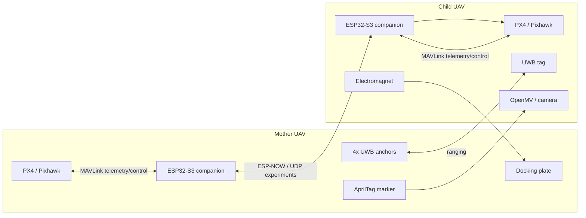

# Mother-Ship Docking Drone System

[Chinese](README.zh-CN.md) | [Project Website](https://isef.rosebeg.com) | [UWB Companion Repository](https://github.com/Ha22yX/UWB-Project)

An experimental dual-UAV mid-air docking research platform focused on **relative localization between a moving mother ship UAV and a child docking UAV**.

The project explores how a child UAV can approach, align with, and dock to a mother UAV in flight. The central challenge is not only flying to a GPS coordinate, but estimating the child UAV's position **relative to the mother UAV** with enough continuity and precision for autonomous control.

> Status: research prototype. This repository contains system-level notes and early PX4/MAVLink, GPS drift, UDP routing, and communication experiments. It is not a ready-to-fly autopilot package.

## Highlights

- Dual-UAV aerial docking architecture: mother UAV as the airborne docking platform, child UAV as the active docking vehicle.
- Multi-stage relative localization using GPS/RTK-GPS, UWB ranging, and AprilTag vision.
- UWB-based mid-range relative position estimation with a 4-anchor mother platform and 1 tag on the child UAV.
- PX4/Pixhawk integration through MAVLink and MAVSDK experiments.
- GPS drift logging utilities for quantifying why GPS-only docking is insufficient.
- Companion UWB repository for embedded firmware, ESP-NOW communication, trilateration, visualization, and Pixhawk integration.

## System Concept

The docking system is designed around a moving reference frame. The mother UAV carries the docking platform and localization references; the child UAV estimates its relative pose and converts that estimate into PX4-compatible control targets.



## Relative Localization Pipeline

The project uses different sensors at different distances. Each sensor covers a part of the docking envelope where it is most useful.

| Stage | Main sensor | Purpose | Output used for control |
| --- | --- | --- | --- |
| Far approach | GPS / RTK-GPS | Bring the child UAV near the mother UAV | Global position target |
| Mid-range alignment | UWB | Estimate child position in the mother-platform frame | Local relative `x, y, z` |
| Final alignment | AprilTag vision | Estimate high-precision terminal pose | Visual servoing error |
| Docking | Vision + UWB + PX4 telemetry | Maintain low-speed approach and trigger attachment | Velocity/position setpoint and magnet control |

### 1. GPS / RTK-GPS for Far Approach

GPS is used to bring the two UAVs into the same operating area. This stage only needs coarse convergence. Even with RTK, GPS is not ideal as the only sensor for physical docking because the final task depends on relative position, not absolute latitude and longitude.

This repository includes `gps_drift_test/GPS_Drift_Logger.py` to log PX4 GPS data, generate drift plots, and quantify GPS-only uncertainty.

### 2. UWB for Mid-Range Relative Position

UWB is the key mid-range relative localization layer. The mother UAV carries four UWB anchors on the docking platform. The child UAV carries one UWB tag. The tag measures distance to each anchor and solves its position in the mother-platform coordinate frame.

The UWB implementation, test firmware, and visualization tools live in the companion repository:

[Ha22yX/UWB-Project](https://github.com/Ha22yX/UWB-Project)

Current UWB geometry used by the test firmware:

- Four anchors are placed at the midpoints of a square docking frame.
- Square side length: `35.5 in` (`0.9017 m`).
- Coordinate origin: center of the docking frame.
- `an0`: right midpoint, approximately `(+HALF, 0, 0)`.
- `an1`: bottom midpoint, approximately `(0, -HALF, 0)`.
- `an2`: left midpoint, approximately `(-HALF, 0, 0)`.
- `an3`: top midpoint, approximately `(0, +HALF, 0)`.
- Positive `z` is above the anchor plane.

The UWB solver:

1. Reads serial ranging output such as `an0:0.57m`.
2. Filters each anchor distance with a small median filter.
3. Linearizes the range equations using anchor 0 as the reference.
4. Solves `x` and `y` with least squares.
5. Estimates `z` from the remaining range residuals and selects the positive mirror solution above the anchor plane.
6. Emits a relative position such as `[POS] x=0.031 m, y=-0.042 m, z=0.615 m`.

This gives the child UAV a position estimate relative to the mother UAV even when both vehicles are moving.

### 3. AprilTag Vision for Terminal Alignment

AprilTag vision is used near the docking point, where the camera can see the mother UAV's tag and estimate terminal pose. This layer is better suited for final alignment than long-range search.

The intended role of AprilTag vision:

- Correct the final lateral and vertical error.
- Estimate terminal orientation relative to the docking plate.
- Provide high-precision feedback before enabling the electromagnet.

### 4. Sensor Fusion and Control

The long-term system design uses an EKF-style fusion layer to turn asynchronous GPS, UWB, visual pose, and PX4 telemetry into a continuous relative state estimate.

Useful state variables include:

- Relative position: `x, y, z`
- Relative velocity: `vx, vy, vz`
- Relative yaw or terminal orientation error
- Sensor confidence, age, and residuals

The controller can then generate either global position targets, local position targets, or body-frame velocity targets for PX4 through MAVLink.

## Repository Scope

This repository is the project-level workspace and contains early Python experiments around PX4 communication, UDP routing, MAVSDK connectivity, and GPS drift analysis.

UWB firmware, ESP-NOW mother/child firmware, Pixhawk embedded sketches, OpenMV experiments, and visualization tools are maintained in [UWB-Project](https://github.com/Ha22yX/UWB-Project).

## Repository Layout

```text
.
├── Drone Control.py
├── Router_Comm_Test.py
├── UDP_MAVLink_Comm_Test.py
├── serial_px4_udp_router.py
├── gps_drift_test/
│   └── GPS_Drift_Logger.py
├── requirement.txt
└── README.md
```

## Scripts

| File | Purpose |
| --- | --- |
| `Drone Control.py` | Early MAVSDK script for connecting to a PX4/QGroundControl forwarding endpoint, waiting for vehicle connection, and checking GPS/home status. |
| `serial_px4_udp_router.py` | Auto-detects a PX4 MAVLink serial port and forwards MAVLink packets between serial and UDP. |
| `UDP_MAVLink_Comm_Test.py` | Tests bidirectional MAVLink communication over UDP using pymavlink heartbeat and safe version requests. |
| `Router_Comm_Test.py` | Uses MAVSDK to connect through the UDP router and read telemetry such as battery, GPS, and health state. |
| `gps_drift_test/GPS_Drift_Logger.py` | Logs PX4 GPS samples, saves CSV output, and generates drift/altitude/satellite plots. |
| `requirement.txt` | Python dependencies for the scripts in this repository. |

## Setup

Install Python dependencies:

```bash
pip install -r requirement.txt
```

Run the GPS drift logger:

```bash
python gps_drift_test/GPS_Drift_Logger.py --duration 120
```

Run the PX4 serial-to-UDP router:

```bash
python serial_px4_udp_router.py --port 14540
```

Test UDP MAVLink communication:

```bash
python UDP_MAVLink_Comm_Test.py --host 127.0.0.1 --port 14540
```

Before running against real hardware, verify:

- PX4/Pixhawk serial port.
- TELEM baud rate.
- UDP port availability.
- QGroundControl and MAVSDK endpoint configuration.
- PX4 arming, failsafe, RC override, and kill-switch settings.

## Development Workflow

Recommended experiment order:

1. Verify MAVLink telemetry on the bench with props removed.
2. Log GPS drift to understand the baseline positioning error.
3. Validate UWB ranging and trilateration in [UWB-Project](https://github.com/Ha22yX/UWB-Project).
4. Confirm anchor IDs, platform geometry, and coordinate-frame directions.
5. Visualize UWB `x, y, z` before connecting it to flight control.
6. Add AprilTag terminal pose validation.
7. Integrate relative localization into a fused control pipeline.
8. Only then attempt low-altitude, low-speed flight tests with manual takeover available.

## Safety

This project involves real UAVs, LiPo batteries, high-speed propellers, autonomous control, and an electromagnet docking mechanism.

- Remove propellers during bench tests.
- Keep a physical RC kill switch and PX4 failsafes enabled.
- Test new control code in simulation or a restrained setup before flight.
- Validate coordinate-frame mappings before enabling autonomous follow/docking.
- Use low altitude, low speed, and open test areas for early flight trials.
- Keep human supervision and manual takeover available at all times.

## Related Repositories

- [Ha22yX/UWB-Project](https://github.com/Ha22yX/UWB-Project): UWB ranging, trilateration, ESP32-S3 firmware, ESP-NOW mother/child communication, Pixhawk integration, OpenMV/AprilTag visualization.

## Suggested GitHub Description

```text
Autonomous dual-UAV mid-air docking research platform using RTK-GPS, UWB trilateration, AprilTag vision, PX4/MAVLink, ESP32, ESP-NOW, and EKF-based relative localization.
```

Suggested topics:

```text
uav, px4, mavlink, esp32, uwb, apriltag, sensor-fusion, ekf, autonomous-docking, robotics
```

## License

No license file is currently included. Add a license before reusing or distributing this project as an open-source package.
