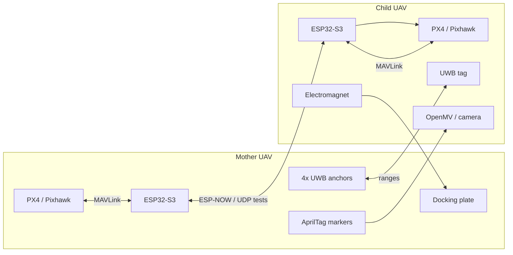

# Mother-Ship Docking Drone System

面向双无人机空中自主对接的多传感器相对定位与控制实验项目。

本项目研究一套“母舰无人机 + 子无人机”的空中对接系统：母机作为空中基站和对接平台，子机在飞行中自动接近、定位、精对准，并通过电磁铁完成锁定。项目重点不是单纯让无人机飞到某个 GPS 坐标，而是让子机稳定获得“相对于母机”的位置和姿态，并把这个相对状态转化为 PX4 可执行的控制目标。

- 项目介绍网站：[https://isef.rosebeg.com](https://isef.rosebeg.com)
- UWB 附属测试仓库：[Ha22yX/UWB-Project](https://github.com/Ha22yX/UWB-Project)
- 当前主仓库：[Ha22yX/Mother-Ship-Docking-Drone-System](https://github.com/Ha22yX/Mother-Ship-Docking-Drone-System)

> Status: research / experimental. This repository is an experiment workspace for UAV docking, PX4/MAVLink communication, GPS drift testing, and system integration. It is not a ready-to-fly autopilot package.

## 项目目标

传统无人机返航、降落或编队飞行通常依赖 GPS 或人工遥控，但空中对接需要更严格的相对位置精度：

- 母机和子机都在空中运动，单机 GPS 位置误差会直接放大为相对位置误差。
- 对接末端需要厘米级甚至更高精度，GPS-only 无法满足要求。
- 视觉 AprilTag 精度高，但可用距离短、视场受限，无法覆盖远距离接近阶段。
- UWB 抗 GPS 退化能力强，适合中近距离相对定位，但单独使用仍不足以完成最终机械对准。

因此，本项目采用多阶段、多传感器融合方案：

1. RTK-GPS / GPS 提供远距离全局接近。
2. UWB 4 anchor + 1 tag 提供母机坐标系下的中距离三维相对位置。
3. OpenMV / AprilTag 提供近距离视觉位姿，用于最终精对准。
4. EKF 将不同传感器的异步、不同精度数据融合为连续的相对状态估计。
5. PX4 / MAVLink 将相对位置误差转换为位置、速度或模式控制命令。

## 系统架构

### Mother UAV

母机是空中基站和对接平台，承担相对定位参考、通信中继和机械对接面的角色。

- PX4 / Pixhawk 飞控，负责基础飞行稳定和遥测输出。
- ESP32-S3 companion computer，负责读取 MAVLink、节点通信和 Web 控制界面。
- 4 个 UWB anchor，固定在对接平台几何边界上，构成相对定位基准。
- AprilTag 标记，提供末端视觉位姿参考。
- 钢制对接板或可被电磁铁吸附的对接结构。

### Child UAV

子机是主动接近和对接的一方，负责感知母机、生成控制目标并完成锁定。

- PX4 / Pixhawk 飞控，执行位置、速度、起飞、降落等控制。
- ESP32-S3 companion computer，负责通信、传感器读取和 MAVLink 控制。
- UWB tag，用于测量到母机 4 个 anchor 的距离。
- OpenMV / camera，用于识别母机 AprilTag 并输出末端位姿。
- 电磁铁，用于最终吸附到母机对接板。



## 核心重点：相对位置获取方案

本项目最关键的部分是从多个传感器中获得稳定、连续、可控的“子机相对于母机”的位置。它不是单一传感器方案，而是按距离和精度分层使用。

### 1. GPS / RTK-GPS：远距离接近

GPS 提供全局坐标，使子机能够先飞到母机附近。这个阶段不追求对接精度，只要求把两架无人机带入 UWB 可工作范围。

- 工作范围：远距离，理论上不受两机间距限制。
- 作用：全局导航、初始会合、粗定位。
- 局限：普通 GPS 米级漂移明显；即使使用 RTK，也不适合直接完成机械对接。
- 本仓库相关代码：`gps_drift_test/GPS_Drift_Logger.py` 用于记录 PX4 GPS 样本并计算漂移指标。

### 2. UWB：中距离三维相对位置

UWB 是本项目相对定位方案的核心中间层。母机固定 4 个 UWB anchor，子机携带 1 个 UWB tag。tag 读取到每个 anchor 的距离后，在母机平台坐标系内求解自身位置。

附属仓库 [Ha22yX/UWB-Project](https://github.com/Ha22yX/UWB-Project) 专门保存 UWB 测距、anchor/tag 固件、三边定位、可视化和 Pixhawk 集成测试。

当前 UWB 测试中使用的基础几何：

- 4 个 anchor 固定在一个正方形平台四条边的中点。
- 正方形边长：35.5 inch，约 0.9017 m。
- `an0`：右侧中点，坐标约 `(+HALF, 0)`。
- `an1`：下侧中点，坐标约 `(0, -HALF)`。
- `an2`：左侧中点，坐标约 `(-HALF, 0)`。
- `an3`：上侧中点，坐标约 `(0, +HALF)`。
- `z` 轴取 anchor 平面上方的正方向，用于表示子机相对母机对接平面的高度。

UWB 求解流程：

1. tag 串口读取测距行，例如 `an0:0.57m`。
2. 对每个 anchor 的距离做中值滤波，降低跳变和偶发噪声。
3. 使用 anchor 0 作为参考，将圆/球面测距方程线性化。
4. 通过最小二乘求解 `x, y`。
5. 由 `z = sqrt(d_i^2 - dx_i^2 - dy_i^2)` 估计高度，并选择 anchor 平面上方的正镜像解。
6. 输出 `[POS] x=..., y=..., z=...`，供可视化、控制或后续 EKF 融合使用。

UWB 的作用是把子机从“只知道全局坐标”推进到“知道自己在母机平台坐标系中的位置”。这一步让系统可以在 GPS 误差较大、母机也在运动、或者需要保持相对静止时继续收敛。

### 3. AprilTag 视觉：近距离精对准

当子机进入母机附近并接近最终对接区域后，视觉系统识别母机上的 AprilTag 标记，输出相机到 tag 的相对位移和姿态。

- 工作范围：近距离，项目网站中按约 0.5 m 级别设计。
- 作用：末端精对准、角度修正、对接面姿态估计。
- 优点：在可见条件下精度高，适合最终电磁吸附前的厘米级调整。
- 局限：受光照、视场、遮挡和距离影响，不适合远距离搜索。

### 4. EKF 融合：连续、可控的相对状态

三种传感器的量测频率、延迟、精度和失效模式都不同。EKF 的作用是把这些传感器统一到同一个状态估计中，使控制器看到的是连续、平滑、有置信度的相对位置，而不是跳变的单点测量。

推荐的融合状态可以包括：

- 相对位置：`x, y, z`
- 相对速度：`vx, vy, vz`
- 相对航向或视觉姿态误差
- 传感器偏置或延迟补偿项

融合策略：

- 远距离提高 GPS/RTK 权重。
- 进入 UWB 范围后增加 UWB 权重，用 UWB 约束母机坐标系下的相对位置。
- 视觉锁定后提高 AprilTag 权重，用于最终精对准。
- 根据测距残差、视觉是否可见、GPS fix type、HDOP/VDOP 和数据 age 调整观测协方差。
- 当 UWB 或视觉数据过期时，控制器降速或进入安全保持。

## 自主对接流程

| 阶段 | 主要传感器 | 目标 | 控制输出 |
| --- | --- | --- | --- |
| 1. 远距会合 | GPS / RTK-GPS | 子机飞到母机附近 | PX4 全局位置目标 |
| 2. UWB 对准 | UWB ranges | 求得母机坐标系下 `x, y, z`，向平台中心收敛 | 局部位置或速度目标 |
| 3. 视觉锁定 | AprilTag | 获得高精度相对位姿，修正横向、纵向和角度误差 | 低速视觉伺服 |
| 4. 电磁对接 | Vision + UWB + PX4 | 保持低速、低误差接近 | 电磁铁吸附 |
| 5. 安全处理 | PX4 telemetry + watchdog | 传感器失效、距离异常或人工中止 | 悬停、降落或退出 |

## 当前主仓库内容

这个仓库保存的是母舰对接系统的早期主控、通信和 GPS/PX4 实验脚本。UWB 相关固件和工具已经拆分到附属仓库 [Ha22yX/UWB-Project](https://github.com/Ha22yX/UWB-Project)。

```text
.
├── Drone Control.py
├── Router_Comm_Test.py
├── UDP_MAVLink_Comm_Test.py
├── serial_px4_udp_router.py
├── gps_drift_test/
│   └── GPS_Drift_Logger.py
├── requirement.txt
└── README.md
```

### 文件说明

- `Drone Control.py`：基于 MAVSDK 的早期飞控连接脚本，用于连接 QGroundControl/PX4 转发端口、等待无人机连接、检查 GPS 和 home position 状态。起飞/降落部分保留为实验代码。
- `serial_px4_udp_router.py`：自动扫描串口和波特率，检测 PX4 MAVLink heartbeat，并在串口和 UDP 端口之间双向转发 MAVLink 数据。
- `UDP_MAVLink_Comm_Test.py`：通过 UDP 测试 pymavlink 与转发器之间的双向 MAVLink 通信，包括 heartbeat、keepalive 和安全的版本请求。
- `Router_Comm_Test.py`：通过 MAVSDK 连接 UDP 转发器，读取电池、GPS、健康状态等遥测样本，用于验证链路稳定性。
- `gps_drift_test/GPS_Drift_Logger.py`：记录 PX4 GPS 数据，保存 CSV，并绘制 XY 漂移、卫星数量、高度漂移和 EKF relative altitude 曲线。
- `requirement.txt`：Python 依赖，包括 MAVSDK、pymavlink、pyserial 和 matplotlib。

## 与 UWB-Project 的关系

[UWB-Project](https://github.com/Ha22yX/UWB-Project) 是本项目的附属仓库，负责 UWB 和部分嵌入式集成实验。两个仓库的分工如下：

| 仓库 | 角色 | 内容 |
| --- | --- | --- |
| `Mother-Ship-Docking-Drone-System` | 主项目说明与早期系统集成测试 | GPS 漂移、PX4/MAVLink、UDP 转发、MAVSDK 连接、总体架构说明 |
| `UWB-Project` | UWB 相对定位与嵌入式测试 | UWB anchor/tag 固件、三边定位、ESP-NOW 母子机通信、Pixhawk 集成、OpenMV/AprilTag 可视化 |

如果要复现实验流程，建议先读本仓库理解系统目标和总体架构，再进入 UWB 仓库验证中距离相对定位方案。

## 安装与运行

安装 Python 依赖：

```bash
pip install -r requirement.txt
```

GPS 漂移记录示例：

```bash
python gps_drift_test/GPS_Drift_Logger.py --duration 120
```

PX4 串口到 UDP 转发示例：

```bash
python serial_px4_udp_router.py --port 14540
```

UDP MAVLink 通信测试：

```bash
python UDP_MAVLink_Comm_Test.py --host 127.0.0.1 --port 14540
```

运行前需要根据本机环境检查：

- PX4 / Pixhawk 串口号。
- TELEM 端口波特率。
- UDP 绑定端口。
- QGroundControl 或 MAVSDK 是否占用同一端口。
- 飞控安全参数、解锁条件、kill switch 和测试场地。

## 开发与实验建议

1. 先做无桨架台测试，只验证串口、MAVLink、UDP 和传感器输出。
2. 使用 `gps_drift_test` 记录静止状态下 GPS 漂移，量化 GPS-only 的误差范围。
3. 在 [UWB-Project](https://github.com/Ha22yX/UWB-Project) 中先验证 anchor/tag 测距和位置求解。
4. 对 UWB 输出做可视化，确认坐标轴方向、anchor ID、平台尺寸和实际安装一致。
5. 再把 UWB/视觉相对位置映射到 PX4 位置或速度控制目标。
6. 最后才进行低高度、低速、有人监督的飞行对接测试。

## 安全说明

本项目涉及真实无人机、锂电池、旋转桨叶、电磁铁和自主飞行控制，必须按实验安全流程执行：

- 架台调试时拆除桨叶。
- 使用遥控器 kill switch 和 PX4 failsafe。
- 电池充电、运输和测试时遵守 LiPo 安全规范。
- 先在开阔、低风、可控环境中测试。
- 自动控制代码上线前先使用日志、仿真或低风险模式验证。
- 对接测试需要旁站监督，并保留人工接管能力。

## 推荐 GitHub 仓库简介

可用于 GitHub About 的短描述：

```text
Autonomous dual-UAV mid-air docking research platform using RTK-GPS, UWB trilateration, AprilTag vision, PX4/MAVLink, ESP32, ESP-NOW, and EKF-based relative localization.
```

推荐 topics：

```text
uav, px4, mavlink, esp32, uwb, apriltag, sensor-fusion, ekf, autonomous-docking, robotics
```

## License

No license file is currently included. Add a license before reusing or distributing the project as an open-source package.
