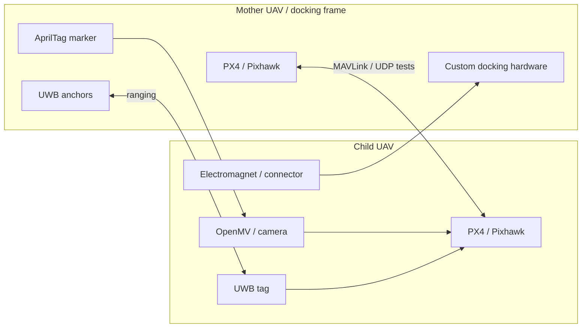

<div align="center">
  <h1>Mother-Ship Docking Drone System</h1>
  <p>Dual-UAV docking research focused on acquiring the child drone's position relative to a moving mother drone.</p>

  <p>
    <a href="README.zh-CN.md">Chinese</a>
    &middot;
    <a href="https://isef.rosebeg.com">Project Website</a>
    &middot;
    <a href="https://github.com/Ha22yX/UWB-Project">UWB Module</a>
    &middot;
    <a href="https://github.com/Ha22yX/OpenMV-AprilTag">Vision Module</a>
  </p>

  <p>
    
    
    
    
    
  </p>
</div>

> [!IMPORTANT]
> **Theoretical validation is complete; full-system flight and docking validation remain incomplete.** Multiple flight attempts have been unsuccessful. Unstable altitude data in the current RTK-GPS software setup is blocking safe docking experiments. See [Current Progress And Blocker](#current-progress-and-blocker).

<p align="center">
  
</p>

<p align="center">
  
</p>

<p align="center"><em>Physical prototype built during the project: mother-frame docking structure, child UAV test platform, UWB hardware, and docking mechanism experiments.</em></p>

## What This Project Is

This repository is the system-level workspace for an experimental aerial docking platform. The goal is to let a smaller child UAV approach and dock with a larger mother UAV while both platforms are treated as moving systems.

The central technical problem is **relative position acquisition**. A child drone cannot dock by knowing only global GPS coordinates. It needs to know where it is inside the mother drone's local docking frame, then convert that relative state into safe control experiments through PX4/MAVLink.

## Current Progress And Blocker

The project's theoretical work and validation of the underlying principles have been completed. A physical prototype has been built, and multiple flight tests have been attempted. However, those flight attempts have been unsuccessful, and **successful autonomous mid-air docking has not yet been demonstrated**. The project remains an unfinished research prototype.

| Area | Current status |
| --- | --- |
| Theoretical design and validation | Complete. |
| Physical prototype | Built; prototype photos and CAD source files are included. |
| Full-system flight validation | Incomplete after multiple unsuccessful flight attempts. |
| Autonomous mid-air docking | Not yet achieved; experiments are blocked by altitude-data instability. |

### Altitude Instability

The current blocker is unstable altitude data in the existing open-source RTK-GPS software setup used for this project. During stationary tests, **reported GPS altitude continued to fluctuate by approximately ±5 m even though the drone was not moving**. This instability prevents safe approach and docking experiments and has blocked completion of flight validation.

The repository includes a [GPS drift logger and plotter](gps_drift_test/GPS_Drift_Logger.py) to record position data and inspect altitude variation. Completing the theoretical validation does not establish successful end-to-end flight performance; the altitude issue and integrated flight tests remain unresolved.

### Remaining Work

1. Resolve the altitude-data instability and verify stable height readings in stationary and controlled flight tests.
2. Resume integrated approach and docking experiments once the altitude issue is resolved.
3. Document successful end-to-end flight and docking results before marking the project complete.

## Core Idea: Relative Position First

The system design uses the following staged localization pipeline. It describes the intended docking sequence; the complete sequence has not yet been validated in flight.

| Stage | Sensor / method | Purpose | Output |
| --- | --- | --- | --- |
| Far approach | GPS / RTK-GPS | Bring the two UAVs into the same operating area. | Global position target |
| Mid-range alignment | UWB anchors + tag | Estimate the child UAV in the mother-frame coordinate system. | Relative `x, y, z` |
| Terminal alignment | AprilTag vision / OpenMV | Refine close-range pose when the docking target is visible. | Visual pose / alignment error |
| Docking experiment | PX4 / MAVLink + hardware | Route telemetry and test low-speed approach logic. | Position/velocity/control experiments |

The UWB layer is the key relative-position solution. The concept places multiple UWB anchors on the mother docking frame and a UWB tag on the child drone. Ranges are filtered and converted into a local position estimate, so the child drone can reason about its offset from the docking center instead of chasing an absolute coordinate.

## System Architecture



## Repository Scope

This main repository keeps the project-level experiments and explanation:

- PX4/MAVLink and UDP communication tests.
- GPS drift logging and visualization utilities.
- Serial-to-UDP routing experiments for flight-controller communication.
- The overall docking architecture and relative-localization concept.
- Physical prototype photo and original SolidWorks CAD source files.

Lower-level localization modules are split into companion repositories so each subsystem can evolve independently.

## Companion Repositories

| Repository | Role | What it contains |
| --- | --- | --- |
| [Mother-Ship-Docking-Drone-System](https://github.com/Ha22yX/Mother-Ship-Docking-Drone-System) | Main project | System architecture, PX4/MAVLink tests, GPS drift experiments, prototype assets, CAD files |
| [UWB-Project](https://github.com/Ha22yX/UWB-Project) | UWB positioning module | ESP32-S3 firmware, UWB ranging, filtering, trilateration, Pixhawk/MAVLink integration, visualization |
| [OpenMV-AprilTag](https://github.com/Ha22yX/OpenMV-AprilTag) | Visual localization module | OpenMV AprilTag detection, 6DoF pose output, UART/USB pose streams, PC visualization tools |

## Hardware And CAD

The project includes original SolidWorks files under [`hardware/solidworks/`](hardware/solidworks/). These drawings cover the drone platform, docking frame, battery bay, GPS mounts, tube clamps, electromagnet connector pieces, motor/propeller references, and related hardware parts.

These files are included as project source material and documentation of the development process. They are not a manufacturing-ready release package; dimensions, material choices, fasteners, and safety constraints should be checked before building from them.

## Quickstart

```bash
git clone https://github.com/Ha22yX/Mother-Ship-Docking-Drone-System.git
cd Mother-Ship-Docking-Drone-System
pip install -r requirement.txt
python UDP_MAVLink_Comm_Test.py
```

Run individual scripts only after checking ports, baud rates, network addresses, PX4 parameters, and vehicle safety settings.

## Tech Stack

| Layer | Technology | Role |
| --- | --- | --- |
| Flight controller | PX4 / Pixhawk | Autopilot platform for telemetry and control experiments. |
| Communication | MAVLink, MAVSDK, pymavlink, UDP | Heartbeat tests, telemetry routing, and serial/UDP bridge experiments. |
| Relative localization | UWB anchors/tag | Mid-range mother-frame `x, y, z` estimate. |
| Terminal vision | AprilTag / OpenMV | Close-range pose and final alignment reference. |
| Hardware design | SolidWorks | Drone frame, docking structure, mounts, and connector parts. |
| Analysis | Python, matplotlib | GPS drift logging and experiment visualization. |

## Project Map

```text
.
├── Drone Control.py                 early drone-control experiment
├── Router_Comm_Test.py              router-side communication test
├── UDP_MAVLink_Comm_Test.py         UDP MAVLink communication test
├── serial_px4_udp_router.py         serial-to-UDP PX4 router experiment
├── gps_drift_test/
│   └── GPS_Drift_Logger.py          GPS drift logger and plotter
├── hardware/solidworks/             original SolidWorks CAD drawings
├── .github/assets/
│   ├── readme-hero.svg              README system overview image
│   └── project-introduction.jpg     physical prototype photo
└── requirement.txt                  Python dependencies
```

## Status And Safety

This is a research prototype and experiment workspace, not a ready-to-fly autopilot package. Real UAV tests require independent safety review, bench validation, propeller-off testing, controlled flight areas, failsafe configuration, and compliance with local aviation rules.
