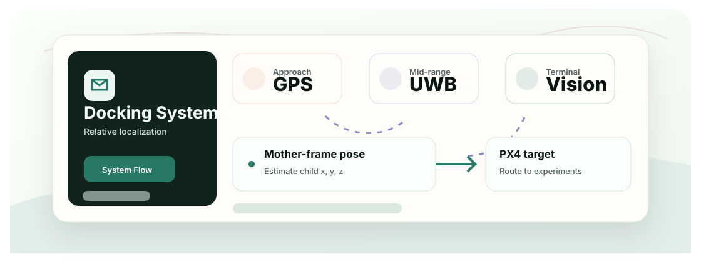

<div align="center">
  <h1>Mother-Ship Docking Drone System</h1>
  <p>以相对位置获取为核心的双无人机自主对接研究项目。</p>

  <p>
    <a href="README.md">English</a>
    &middot;
    <a href="#快速开始">快速开始</a>
    &middot;
    <a href="#技术栈">技术栈</a>
    &middot;
    <a href="https://isef.rosebeg.com">项目网站</a>
    &middot;
    <a href="https://github.com/Ha22yX/UWB-Project">UWB 模块</a>
    &middot;
    <a href="https://github.com/Ha22yX/OpenMV-AprilTag">视觉模块</a>
  </p>

  <p>
    
    
    
    
    
  </p>
</div>

<p align="center">
  
</p>

## 项目价值

空中对接的关键不是飞到某个 GPS 点，而是让子无人机持续知道自己在母机运动坐标系中的相对位置，并把这个结果转成 PX4/MAVLink 可用的实验控制信息。

## 快速开始

```bash
git clone https://github.com/Ha22yX/Mother-Ship-Docking-Drone-System.git
cd Mother-Ship-Docking-Drone-System
pip install -r requirement.txt
python UDP_MAVLink_Comm_Test.py
```

运行具体脚本前，请先确认端口、波特率、网络地址和飞控安全设置。

## 核心功能

- 系统级实验仓库，包含 GPS 漂移、PX4/MAVLink、UDP 路由和通信测试。
- 相对定位链路：GPS/RTK 负责接近，UWB 负责中距离相对位置，AprilTag 负责末端姿态。
- 模块关系清晰：UWB-Project 负责 UWB/嵌入式测试，OpenMV-AprilTag 负责视觉姿态测试。
- 以研究和验证为目标，展示对接系统架构与实验路径。

## 技术栈

| Layer | Technology | Role |
| --- | --- | --- |
| 飞控 | PX4 / Pixhawk | 飞控与遥测实验。 |
| 通信 | MAVLink, MAVSDK, UDP | 车辆通信与路由测试。 |
| 定位 | UWB + AprilTag | 相对位置与末端姿态参考。 |
| 分析 | Python, matplotlib | GPS 漂移记录和实验脚本。 |


## 项目说明

这是主项目。[UWB-Project](https://github.com/Ha22yX/UWB-Project) 是 UWB 定位附属仓库，[OpenMV-AprilTag](https://github.com/Ha22yX/OpenMV-AprilTag) 是视觉定位附属仓库。


## 项目结构

```text
gps_drift_test/              GPS drift logger
Drone Control.py             early control experiment
UDP_MAVLink_Comm_Test.py     UDP MAVLink test
serial_px4_udp_router.py     serial-to-UDP routing test
```
