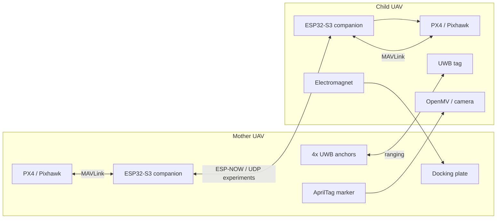

# Mother-Ship Docking Drone System

[English](README.md) | [项目网站](https://isef.rosebeg.com) | [UWB 附属仓库](https://github.com/Ha22yX/UWB-Project)

这是一个面向双无人机空中自主对接的研究型项目，重点是让子无人机在母无人机也处于运动状态时，稳定获得“相对于母机”的位置，并把这个相对状态转换成 PX4 可执行的控制目标。

> 状态：研究原型。本仓库包含项目级说明，以及 PX4/MAVLink、GPS 漂移、UDP 转发、MAVSDK 通信等早期实验脚本。它不是可直接飞行的完整自动驾驶软件包。

## 项目重点

- 双无人机空中对接：母机作为空中对接平台，子机主动接近并完成对接。
- 多阶段相对定位：GPS/RTK-GPS、UWB、AprilTag 视觉按距离分层工作。
- UWB 中距离相对定位：母机 4 个 anchor，子机 1 个 tag，求解母机平台坐标系下的 `x, y, z`。
- PX4/Pixhawk 集成：通过 MAVLink 和 MAVSDK 做遥测、转发和控制测试。
- GPS 漂移分析：量化仅依赖 GPS 完成对接的局限。
- UWB 相关固件和工具放在附属仓库 [UWB-Project](https://github.com/Ha22yX/UWB-Project)。

## 系统概念

本项目不是简单飞到一个 GPS 点，而是在母机作为移动参考系的情况下完成相对定位和控制。



## 相对定位流程

| 阶段 | 主要传感器 | 作用 | 控制输出 |
| --- | --- | --- | --- |
| 远距离接近 | GPS / RTK-GPS | 让子机飞到母机附近 | 全局位置目标 |
| 中距离对准 | UWB | 获取母机平台坐标系下的 `x, y, z` | 局部相对位置或速度目标 |
| 末端对准 | AprilTag 视觉 | 高精度位姿修正 | 视觉伺服误差 |
| 最终对接 | Vision + UWB + PX4 telemetry | 低速接近并吸附 | setpoint 与电磁铁控制 |

### GPS / RTK-GPS

GPS 用于远距离会合。它能把两架无人机带入同一工作区域，但由于对接需要的是相对位置而不是绝对经纬度，GPS-only 不适合直接完成最终机械对接。

本仓库的 `gps_drift_test/GPS_Drift_Logger.py` 可用于记录 PX4 GPS 数据并生成漂移图。

### UWB

UWB 是中距离相对定位的核心。母机平台上布置 4 个 UWB anchor，子机携带 1 个 UWB tag。tag 测量到各 anchor 的距离后，在母机平台坐标系中求解自身位置。

UWB 固件和工具位于 [Ha22yX/UWB-Project](https://github.com/Ha22yX/UWB-Project)。

当前测试几何：

- 4 个 anchor 位于正方形平台四条边的中点。
- 边长 `35.5 in`，约 `0.9017 m`。
- 原点为平台中心。
- `an0` 为右侧中点，`an1` 为下侧中点，`an2` 为左侧中点，`an3` 为上侧中点。
- `z` 轴取 anchor 平面上方为正。

UWB 求解流程：

1. 读取类似 `an0:0.57m` 的测距输出。
2. 对每个 anchor 的距离做中值滤波。
3. 以 anchor 0 为参考线性化测距方程。
4. 最小二乘求解 `x, y`。
5. 根据距离残差估计正向 `z`。
6. 输出如 `[POS] x=0.031 m, y=-0.042 m, z=0.615 m` 的相对位置。

### AprilTag 视觉

AprilTag 用于最终接近阶段，提供更高精度的末端相对位姿，用来修正横向、垂直和姿态误差，并辅助电磁铁吸附前的最后对准。

### 融合与控制

长期设计中，GPS、UWB、视觉和 PX4 遥测会进入 EKF 类融合层，生成连续的相对位置、相对速度和姿态误差估计。控制器再通过 MAVLink 给 PX4 发送全局位置、局部位置或机体系速度目标。

## 本仓库内容

本仓库主要保存项目级说明和早期 Python 实验脚本。UWB 固件、ESP-NOW 母子机固件、Pixhawk 嵌入式测试、OpenMV 视觉实验和可视化工具位于 [UWB-Project](https://github.com/Ha22yX/UWB-Project)。

```text
.
├── Drone Control.py
├── Router_Comm_Test.py
├── UDP_MAVLink_Comm_Test.py
├── serial_px4_udp_router.py
├── gps_drift_test/
│   └── GPS_Drift_Logger.py
├── requirement.txt
└── README.md
```

| 文件 | 作用 |
| --- | --- |
| `Drone Control.py` | MAVSDK 连接和 GPS/Home 状态检查实验。 |
| `serial_px4_udp_router.py` | 自动检测 PX4 MAVLink 串口，并在串口与 UDP 之间转发 MAVLink 数据。 |
| `UDP_MAVLink_Comm_Test.py` | 使用 pymavlink 测试 UDP MAVLink 双向通信。 |
| `Router_Comm_Test.py` | 使用 MAVSDK 通过 UDP 转发器读取电池、GPS、健康状态等遥测。 |
| `gps_drift_test/GPS_Drift_Logger.py` | 记录 PX4 GPS 样本，保存 CSV，并生成漂移图。 |
| `requirement.txt` | Python 依赖。 |

## 安装与运行

```bash
pip install -r requirement.txt
```

记录 GPS 漂移：

```bash
python gps_drift_test/GPS_Drift_Logger.py --duration 120
```

运行 PX4 串口到 UDP 转发：

```bash
python serial_px4_udp_router.py --port 14540
```

测试 UDP MAVLink 通信：

```bash
python UDP_MAVLink_Comm_Test.py --host 127.0.0.1 --port 14540
```

运行前请确认 PX4 串口、TELEM 波特率、UDP 端口、QGroundControl/MAVSDK 配置和飞控安全参数。

## 实验建议

1. 先拆桨做架台 MAVLink 遥测验证。
2. 记录 GPS 漂移，量化 GPS-only 误差。
3. 在 UWB 仓库验证 anchor/tag 测距和三边定位。
4. 校准 anchor ID、平台尺寸和坐标轴方向。
5. 可视化 UWB `x, y, z` 后再接入飞控控制。
6. 验证 AprilTag 末端位姿。
7. 最后再做低高度、低速度、可人工接管的飞行测试。

## 安全说明

- 架台测试必须拆除桨叶。
- 保留 RC kill switch 和 PX4 failsafe。
- 未校准坐标映射前不要启用自动跟随或自动对接。
- 先仿真或低风险验证，再实飞。
- 早期测试保持低高度、低速度，并有人工监督。

## 相关仓库

- [Ha22yX/UWB-Project](https://github.com/Ha22yX/UWB-Project)：UWB 测距、三边定位、ESP32-S3 固件、ESP-NOW 母子机通信、Pixhawk 集成和 OpenMV/AprilTag 可视化。

## License

当前仓库暂未包含 license 文件。若需要作为开源项目复用或分发，建议补充明确 license。
