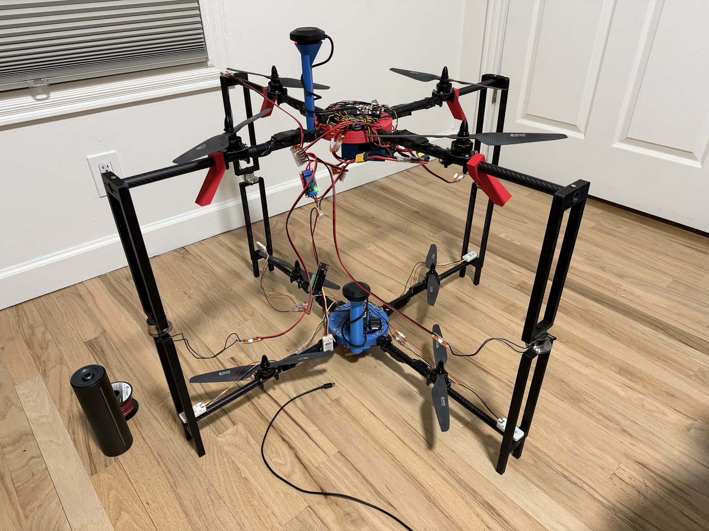
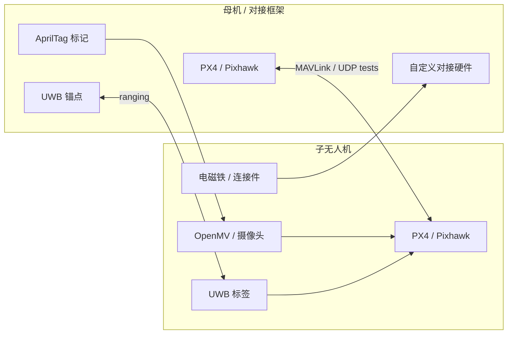

<div align="center">
  <h1>Mother-Ship Docking Drone System</h1>
  <p>以“子无人机相对母机的位置获取”为核心的双无人机自主对接研究项目。</p>

  <p>
    <a href="README.md">English</a>
    &middot;
    <a href="https://isef.rosebeg.com">项目网站</a>
    &middot;
    <a href="https://github.com/Ha22yX/UWB-Project">UWB 模块</a>
    &middot;
    <a href="https://github.com/Ha22yX/OpenMV-AprilTag">视觉模块</a>
  </p>

  <p>
    
    
    
    
    
  </p>
</div>

> [!IMPORTANT]
> **理论验证已完成；完整系统的实机飞行与对接验证尚未完成。** 项目已多次尝试飞行，但均未成功。当前 RTK-GPS 软件环境中的高度数据不稳定，阻碍了安全开展对接实验。详见[当前进展与阻塞问题](#当前进展与阻塞问题)。

<p align="center">
  
</p>

<p align="center">
  
</p>

<p align="center"><em>项目开发期间搭建的实体原型：母机对接框架、子无人机测试平台、UWB 硬件和对接机构实验。</em></p>

## 这个项目是什么

这个仓库是一个实验性空中对接平台的系统级工作区。项目目标是让一架较小的子无人机接近并对接到一架较大的母机，同时把两架无人机都视为运动平台。

核心技术问题是 **相对位置获取**。子无人机不能只依赖全局 GPS 坐标完成对接。它需要知道自己在母机局部对接坐标系中的位置，再把这个相对状态转成 PX4/MAVLink 可用的安全控制实验。

## 当前进展与阻塞问题

项目的理论工作及相关原理验证均已完成，实体原型已搭建，并已进行多次飞行测试尝试。但这些飞行尝试均未成功，**目前尚未成功完成自主空中对接**。项目仍处于尚未完成的研究原型阶段。

| 内容 | 当前状态 |
| --- | --- |
| 理论设计与验证 | 已完成。 |
| 实体原型 | 已搭建；仓库包含原型照片和 CAD 源文件。 |
| 完整系统的实机飞行验证 | 已多次尝试飞行，但均未成功，验证尚未完成。 |
| 自主空中对接 | 尚未实现；实验受高度数据不稳定问题阻塞。 |

### 高度数据不稳定

当前阻塞来自本项目使用的既有开源 RTK-GPS 软件环境中的高度数据不稳定问题。在静止测试中，**无人机没有移动时，GPS 报告的高度仍会出现约 ±5 米的跳动**。这种不稳定使接近和对接实验无法安全进行，也阻碍了实机飞行验证的完成。

仓库包含 [GPS 漂移记录与绘图工具](gps_drift_test/GPS_Drift_Logger.py)，用于记录位置数据并观察高度变化。理论验证完成并不代表完整系统已通过实机验证；高度数据问题和整机飞行验证仍待解决。

### 后续工作

1. 解决高度数据不稳定问题，并在静止测试和受控飞行测试中验证高度读数的稳定性。
2. 在高度问题解决后，继续开展整机接近与对接实验。
3. 完成并记录完整飞行与对接流程的成功验证，再将项目标记为完成。

## 核心思路：先解决相对位置

系统设计采用以下分阶段定位链路。这是预期的对接流程，完整流程尚未通过实机飞行验证。

| 阶段 | 传感器 / 方法 | 目的 | 输出 |
| --- | --- | --- | --- |
| 远距离接近 | GPS / RTK-GPS | 让两架无人机进入同一作业区域。 | 全局位置目标 |
| 中距离对准 | UWB 锚点 + 标签 | 在母机坐标系中估计子无人机位置。 | 相对 `x, y, z` |
| 末端对准 | AprilTag 视觉 / OpenMV | 目标可见后修正近距离姿态。 | 视觉位姿 / 对准误差 |
| 对接实验 | PX4 / MAVLink + 机构 | 路由遥测并测试低速接近逻辑。 | 位置 / 速度 / 控制实验 |

其中 UWB 层是主要的相对位置方案。系统构想是在母机对接框架上布置多个 UWB 锚点，在子无人机上放置 UWB 标签。标签到锚点的距离经过滤波和解算后，得到子无人机相对对接中心的局部位置，而不是让子无人机只追踪一个绝对坐标。

## 系统架构



## 仓库范围

这个主仓库保存项目级实验和说明：

- PX4/MAVLink 与 UDP 通信测试。
- GPS 漂移记录和可视化工具。
- 用于飞控通信的串口到 UDP 路由实验。
- 整体对接架构和相对定位方案说明。
- 实体原型照片和原始 SolidWorks CAD 源文件。

更底层的定位模块拆分到附属仓库中，方便每个子系统独立迭代。

## 附属仓库

| 仓库 | 角色 | 内容 |
| --- | --- | --- |
| [Mother-Ship-Docking-Drone-System](https://github.com/Ha22yX/Mother-Ship-Docking-Drone-System) | 主项目 | 系统架构、PX4/MAVLink 测试、GPS 漂移实验、实体原型素材、CAD 图纸 |
| [UWB-Project](https://github.com/Ha22yX/UWB-Project) | UWB 定位模块 | ESP32-S3 固件、UWB 测距、滤波、三边定位、Pixhawk/MAVLink 集成、可视化 |
| [OpenMV-AprilTag](https://github.com/Ha22yX/OpenMV-AprilTag) | 视觉定位模块 | OpenMV AprilTag 检测、6DoF 位姿输出、UART/USB 位姿流、PC 可视化工具 |

## 硬件与 CAD 图纸

项目原始 SolidWorks 图纸已放在 [`hardware/solidworks/`](hardware/solidworks/) 中。图纸包括无人机平台、对接框架、电池仓、GPS 支架、管夹、电磁铁连接件、电机/螺旋桨参考件和其他相关硬件部件。

这些文件作为项目开发过程的源材料和文档保存，并不是可直接量产的制造发布包。实际加工前仍需要重新检查尺寸、材料、紧固件和安全约束。

## 快速开始

```bash
git clone https://github.com/Ha22yX/Mother-Ship-Docking-Drone-System.git
cd Mother-Ship-Docking-Drone-System
pip install -r requirement.txt
python UDP_MAVLink_Comm_Test.py
```

运行具体脚本前，请先确认端口、波特率、网络地址、PX4 参数和飞行器安全设置。

## 技术栈

| 层级 | 技术 | 作用 |
| --- | --- | --- |
| 飞控 | PX4 / Pixhawk | 遥测和控制实验的自动驾驶平台。 |
| 通信 | MAVLink, MAVSDK, pymavlink, UDP | 心跳测试、遥测路由、串口/UDP 桥接实验。 |
| 相对定位 | UWB 锚点 / 标签 | 中距离母机坐标系 `x, y, z` 估计。 |
| 末端视觉 | AprilTag / OpenMV | 近距离位姿与最终对准参考。 |
| 硬件设计 | SolidWorks | 无人机框架、对接结构、支架和连接件。 |
| 分析 | Python, matplotlib | GPS 漂移记录和实验可视化。 |

## 项目结构

```text
.
├── Drone Control.py                 early drone-control experiment
├── Router_Comm_Test.py              router-side communication test
├── UDP_MAVLink_Comm_Test.py         UDP MAVLink communication test
├── serial_px4_udp_router.py         serial-to-UDP PX4 router experiment
├── gps_drift_test/
│   └── GPS_Drift_Logger.py          GPS drift logger and plotter
├── hardware/solidworks/             original SolidWorks CAD drawings
├── .github/assets/
│   ├── readme-hero.svg              README system overview image
│   └── project-introduction.jpg     physical prototype photo
└── requirement.txt                  Python dependencies
```

## 状态与安全说明

这是研究原型和实验工作区，不是可直接飞行的自动驾驶软件包。真实无人机测试需要独立安全审查、台架验证、拆桨测试、受控飞行区域、失控保护配置，并遵守当地航空规则。
